# ドメインモデル図

## DDD Layered Architecture

```mermaid
classDiagram
    %% ============================================
    %% Shared (共通値オブジェクト層)
    %% ============================================
    class Money {
        +decimal.Decimal Amount
        +string Currency
    }

    class DateRange {
        +time.Time From
        +time.Time To
    }

    class TransportMode {
        <<enumeration>>
        OCEAN
        AIR
        TRUCK
        Railway
    }

    class LocationType {
        <<enumeration>>
        PORT
        AIRPORT
        RAIL_TERMINAL
        WAREHOUSE
        CONTAINER_YARD
        DOOR
        BORDER
        +ValidForMode(TransportMode) bool
    }

    %% ============================================
    %% Route (ルーティング集約)
    %% ============================================
    class Location {
        +uuid.UUID ID
        +string Name
        +string* UnLocode
        +string CountryCode
        +string Type
    }

    class Lane {
        +uuid.UUID ID
        +uuid.UUID OriginID
        +uuid.UUID DestinationID
        +TransportMode Mode
        +decimal.Decimal DistanceKm
    }

    class PhysicalRoute {
        +uuid.UUID ID
        +uuid.UUID OriginID
        +uuid.UUID DestinationID
        +RouteSegment[] Segments
    }

    class RouteSegment {
        +int SequenceOrder
        +uuid.UUID OriginLocationID
        +LocationType OriginType
        +uuid.UUID DestLocationID
        +LocationType DestType
        +TransportMode Mode
        +decimal.Decimal DistanceKm
        +uuid.UUID* MasterLaneID
    }

    %% ============================================
    %% Commercial (商取引集約)
    %% ============================================
    class ProviderType {
        <<enumeration>>
        CARRIER
        AIRLINE
        TRUCKING_COMPANY
        FORWARDER
        NVOCC
        WAREHOUSE
        CUSTOMS_BROKER
        +IsAssetBased() bool
    }

    class LogisticsProvider {
        +uuid.UUID ID
        +string Name
        +ProviderType Type
    }

    class ServiceContract {
        +uuid.UUID ID
        +uuid.UUID ProviderID
        +uuid.UUID ShipperID
        +DateRange ValidPeriod
        +Tariff[] Tariffs
    }

    class Tariff {
        +uuid.UUID ID
        +uuid.UUID ContractID
        +string Name
        +DateRange EffectiveDate
        +TariffLineItem[] LineItems
    }

    class TariffLineItem {
        +uuid.UUID ID
        +string ChargeCode
        +string Category
        +ServiceScope Scope
        +PricingStrategy Logic
    }

    %% ============================================
    %% Context (コンテキスト層)
    %% ============================================
    class ShipmentContext {
        +PhysicalRoute Route
        +decimal.Decimal Quantity
        +decimal.Decimal WeightKG
        +decimal.Decimal VolumeM3
        +map Attributes
    }

    %% ============================================
    %% Logic (ビジネスロジック層)
    %% ============================================
    class ServiceScope {
        <<interface>>
        +IsApplicable(ShipmentContext) bool
    }

    class LocationService {
        +uuid.UUID LocationID
        +string ServiceType
        +IsApplicable(ShipmentContext) bool
    }

    class TransportationService {
        +uuid.UUID OriginID
        +uuid.UUID DestinationID
        +TransportMode Mode
        +IsApplicable(ShipmentContext) bool
    }

    class PricingStrategy {
        <<interface>>
        +Calculate(ShipmentContext) Money, error
        +Type() string
    }

    class FlatStrategy {
        +Money Amount
        +Type() string
        +Calculate(ShipmentContext) Money, error
    }

    class CelExpressionStrategy {
        +string Formula
        +string Currency
        +Type() string
        +Calculate(ShipmentContext) Money, error
    }

    class CompositeStrategy {
        +PricingStrategy[] Steps
        +Type() string
        +Calculate(ShipmentContext) Money, error
    }

    %% ============================================
    %% Service (ドメインサービス層)
    %% ============================================
    class FreightEstimator {
        +Estimate(ShipmentContext, Tariff) EstimatedCost, error
    }

    class EstimatedCost {
        +uuid.UUID TariffID
        +CalculatedLineItem[] LineItems
    }

    class CalculatedLineItem {
        +string ChargeCode
        +string Category
        +Money Amount
    }

    %% ============================================
    %% Relationships (関連)
    %% ============================================

    %% Route Aggregate
    PhysicalRoute o-- RouteSegment : contains
    RouteSegment --> Location : origin
    RouteSegment --> Location : destination
    RouteSegment --> Lane : references (optional)
    RouteSegment ..> TransportMode : uses
    RouteSegment ..> LocationType : uses
    Lane --> Location : origin
    Lane --> Location : destination
    Lane ..> TransportMode : uses

    %% Commercial Aggregate
    ServiceContract --> LogisticsProvider : provider
    ServiceContract o-- Tariff : contains
    ServiceContract ..> DateRange : uses
    Tariff o-- TariffLineItem : contains
    Tariff ..> DateRange : uses
    TariffLineItem --> ServiceScope : has
    TariffLineItem --> PricingStrategy : has
    LogisticsProvider ..> ProviderType : uses

    %% Logic Layer
    LocationService ..|> ServiceScope : implements
    TransportationService ..|> ServiceScope : implements
    FlatStrategy ..|> PricingStrategy : implements
    CelExpressionStrategy ..|> PricingStrategy : implements
    CompositeStrategy ..|> PricingStrategy : implements
    CompositeStrategy o-- PricingStrategy : contains

    %% Context Layer
    ShipmentContext --> PhysicalRoute : has

    %% Service Layer
    FreightEstimator ..> ShipmentContext : uses
    FreightEstimator ..> Tariff : uses
    FreightEstimator ..> EstimatedCost : produces
    EstimatedCost o-- CalculatedLineItem : contains
    CalculatedLineItem ..> Money : uses

    %% Shared Layer
    FlatStrategy ..> Money : uses
    CelExpressionStrategy ..> Money : uses
    CompositeStrategy ..> Money : uses
```

## レイヤー説明

### 1. Shared Layer (共通値オブジェクト層)
- **Money**: 金額と通貨を表現
- **DateRange**: 期間を表現（契約有効期限、料金適用期間など）
- **TransportMode**: 輸送モード（海上、航空、トラック、鉄道）
- **LocationType**: 拠点種別（港、空港、倉庫など）

### 2. Route Aggregate (ルーティング集約)
- **Location**: 物理的な拠点（港、倉庫、空港など）
- **Lane**: 2点間の物理的な輸送路（マスターデータ）
- **PhysicalRoute**: 順序を持った区間の集合体（Origin→Destination）
- **RouteSegment**: A地点からB地点への移動を表す最小単位

### 3. Commercial Aggregate (商取引集約)
- **LogisticsProvider**: 物流企業（キャリア、フォワーダーなど）
- **ServiceContract**: 契約（プロバイダーと荷主間の合意）
- **Tariff**: 料金表（契約に紐づく料金項目の集合）
- **TariffLineItem**: 個別の料金定義（THC、運賃など）

### 4. Context Layer (コンテキスト層)
- **ShipmentContext**: 見積計算に必要な全てのコンテキスト情報
  - 物理ルート情報
  - 貨物情報（数量、重量、容積）
  - カスタム属性

### 5. Logic Layer (ビジネスロジック層)
- **ServiceScope**: 料金適用範囲を判定するインターフェース
  - LocationService: 場所ベースのサービス（THC、保管など）
  - TransportationService: 輸送ベースのサービス（海上運賃、ドレージなど）
- **PricingStrategy**: 料金計算ロジックのインターフェース
  - FlatStrategy: 定額料金
  - CelExpressionStrategy: CEL式による動的計算
  - CompositeStrategy: 複数戦略の合成（基本運賃+サーチャージなど）

### 6. Service Layer (ドメインサービス層)
- **FreightEstimator**: 見積計算サービス
  - ShipmentContextとTariffを受け取り、EstimatedCostを生成
  - 各TariffLineItemについて適用範囲チェック→金額計算を実行

## 主要な設計パターン

1. **Strategy Pattern**: PricingStrategyによる計算ロジックの分離
2. **Composite Pattern**: CompositeStrategyによる料金の合成
3. **Value Object**: Money, DateRange（不変性、等価性）
4. **Aggregate**: Route集約、Commercial集約による境界明確化
5. **Domain Service**: FreightEstimatorによる複数集約にまたがるロジック
