# ドメインモデル図

## DDD 概念モデル

このドメインモデルは、国際物流SCMプラットフォームのコア設計を表現しています。
商流（Shipment）と実行（TrackingUnit）を分離し、各時点での費用算出とGap分析を可能にします。

```mermaid
classDiagram
    %% ============================================
    %% Shared Layer (共通値オブジェクト層)
    %% ============================================
    class Money["金額<br/>(Money)"] {
        Amount: Decimal
        Currency: String
    }

    class DateRange["期間<br/>(DateRange)"] {
        From: Time
        To: Time
    }

    class TransportMode["輸送モード<br/>(TransportMode)"] {
        <<enumeration>>
        OCEAN
        AIR
        TRUCK
        Railway
    }

    class LocationType["拠点種別<br/>(LocationType)"] {
        <<enumeration>>
        PORT
        AIRPORT
        RAIL_TERMINAL
        WAREHOUSE
        CONTAINER_YARD
        DOOR
        BORDER
    }

    class TrackingStatus["追跡ステータス<br/>(TrackingStatus)"] {
        <<enumeration>>
        BOOKED
        IN_TRANSIT
        EXCEPTION
        ARRIVED
    }

    %% ============================================
    %% Route Aggregate (ルーティング集約)
    %% ============================================
    namespace ルーティング集約 {
        class Location["拠点<br/>(Location)"] {
            ID: UUID
            Name: String
            UnLocode: String
            CountryCode: String
            Type: String
        }

        class Lane["輸送路<br/>(Lane)"] {
            ID: UUID
            OriginID: UUID
            DestinationID: UUID
            Mode: TransportMode
            DistanceKm: Decimal
        }

        class PhysicalRoute["物理ルート<br/>(PhysicalRoute)"] {
            ID: UUID
            OriginID: UUID
            DestinationID: UUID
        }

        class RouteSegment["ルート区間<br/>(RouteSegment)"] {
            ID: UUID
            SequenceOrder: Int
            OriginLocationID: UUID
            OriginType: LocationType
            DestLocationID: UUID
            DestType: LocationType
            Mode: TransportMode
            DistanceKm: Decimal
            MasterLaneID: UUID
        }
    }

    %% ============================================
    %% Commercial Aggregate (商取引集約)
    %% ============================================
    namespace 商取引集約 {
        class LogisticsProvider["物流企業<br/>(LogisticsProvider)"] {
            <<Aggregate Root>>
            ID: UUID
            Name: String
            Type: ProviderType
        }

        class ProviderType["業者種別<br/>(ProviderType)"] {
            <<enumeration>>
            CARRIER
            AIRLINE
            TRUCKING_COMPANY
            FORWARDER
            NVOCC
            WAREHOUSE
            CUSTOMS_BROKER
        }

        class ServiceContract["サービス契約<br/>(ServiceContract)"] {
            <<Aggregate Root>>
            ID: UUID
            ProviderID: UUID
            ShipperID: UUID
            status: ContractStatus
            ValidPeriod: DateRange
            tariffs: Tariff[]
            CreatedAt: Time
            UpdatedAt: Time
        }

        class ContractStatus["契約ステータス<br/>(ContractStatus)"] {
            <<enumeration>>
            DRAFT
            CONTRACTED
            EXPIRED
            CANCELLED
        }

        class Tariff["料金表<br/>(Tariff)"] {
            ID: UUID
            Name: String
            Version: Int
            BaseVersionID: UUID
            EffectiveDate: DateRange
        }

        class TariffLineItem["料金項目<br/>(TariffLineItem)"] {
            ID: UUID
            ChargeCode: String
            Category: String
            Scope: ServiceScope
            Logic: PricingStrategy
        }
    }

    %% ============================================
    %% Rate Aggregate (社内レート集約)
    %% ============================================
    namespace 社内レート集約 {
        class Rate["社内レート<br/>(Rate)"] {
            <<Aggregate Root>>
            ID: UUID
            ShipperID: UUID
            Name: String
            ValidPeriod: DateRange
            status: RateStatus
            entries: RateEntry[]
            CreatedAt: Time
            UpdatedAt: Time
        }

        class RateStatus["レートステータス<br/>(RateStatus)"] {
            <<enumeration>>
            DRAFT
            ACTIVE
            EXPIRED
        }

        class RateEntry["レートエントリ<br/>(RateEntry)"] {
            ID: UUID
            ProviderID: UUID
            ContractID: UUID
            TariffID: UUID
        }

        class RouteScope["ルート適用範囲<br/>(RouteScope)"] {
            <<Value Object>>
            OriginID: UUID
            DestinationID: UUID
            TransportMode: TransportMode
        }
    }

    %% ============================================
    %% Shipment Aggregate (出荷案件集約)
    %% ============================================
    namespace 出荷案件集約 {
        class Shipment["出荷案件<br/>(Shipment)"] {
            <<Aggregate Root>>
            ID: UUID
            ShipmentNo: String
            ShipperID: UUID
            ConsigneeID: UUID
            trackingUnitIDs: UUID[]
            status: ShipmentStatus
            CreatedAt: Time
            UpdatedAt: Time
        }

        class ShipmentStatus["出荷ステータス<br/>(ShipmentStatus)"] {
            <<enumeration>>
            PLANNED
            BOOKED
            IN_TRANSIT
            EXCEPTION
            COMPLETED
            CANCELLED
        }

        class ShipmentPlan["出荷計画<br/>(ShipmentPlan)"] {
            PlannedRoute: PhysicalRoute
            RateID: UUID
            TransportRequirements: Map
        }

        class ShipmentItem["貨物明細<br/>(ShipmentItem)"] {
            ID: UUID
            Commodity: String
            HSCode: String
            Quantity: Decimal
            WeightKG: Decimal
            VolumeM3: Decimal
            PackageType: String
            LoadedOnTrackingID: UUID
            Attributes: Map
        }

        class ShipmentCost["出荷費用<br/>(ShipmentCost)"] {
            EstimatedCost: EstimatedCost
            EstimatedActualCost: EstimatedActualCost
            ActualCost: ActualCost
            IsFinalized: Bool
        }
    }

    %% ============================================
    %% Tracking Aggregate (追跡集約)
    %% ============================================
    namespace 追跡集約 {
        class TrackingUnit["追跡単位<br/>(TrackingUnit)"] {
            <<Aggregate Root>>
            ID: UUID
            TrackingNumber: TrackingNumber
            CarrierID: UUID
            segments: TrackingSegment[]
            currentStatus: TrackingStatus
            LastUpdated: Time
        }

        class TrackingNumber["追跡番号<br/>(TrackingNumber)"] {
            <<Value Object>>
            Number: String
            Type: TrackingNumberType
        }

        class TrackingNumberType["追跡番号種別<br/>(TrackingNumberType)"] {
            <<enumeration>>
            CONTAINER
            AIRWAY_BILL
            BILL_OF_LADING
            BOOKING_NUMBER
        }

        class TrackingSegment["追跡区間<br/>(TrackingSegment)"] {
            ID: UUID
            ActualOriginLocationID: UUID
            ActualDestLocationID: UUID
            Mode: TransportMode
            CarrierTrackingNumber: String
            PrimarySource: TrackingSourceType
            Status: TrackingStatus
            ActualDeparture: Time
            ActualArrival: Time
            EstimatedArrival: Time
        }

        class TrackingEvent["追跡イベント<br/>(TrackingEvent)"] {
            <<Value Object>>
            ID: UUID
            Timestamp: Time
            Source: TrackingSourceType
            Code: String
            Description: String
            LocationRaw: String
            RawPayload: String
        }

        class TrackingSourceType["追跡情報源<br/>(TrackingSourceType)"] {
            <<enumeration>>
            SEARATES_API
            MANUAL_INPUT
            PARTNER_EDI
            DRIVER_APP
            IOT_DEVICE
        }
    }

    %% ============================================
    %% Cost (費用関連)
    %% ============================================
    class EstimatedCost["見積費用<br/>(EstimatedCost)"] {
        <<Value Object>>
        RateID: UUID
        TotalAmount: Money
        CalculatedAt: Time
        CalculationBase: String
    }

    class EstimatedActualCost["想定実費用<br/>(EstimatedActualCost)"] {
        <<Value Object>>
        ShipmentID: UUID
        RateID: UUID
        TotalAmount: Money
        CalculatedAt: Time
        CalculationBase: String
    }

    class ActualCost["実請求額<br/>(ActualCost)"] {
        <<Value Object>>
        InvoiceID: UUID
        InvoiceNo: String
        ProviderID: UUID
        TotalAmount: Money
        InvoiceDate: Time
    }

    class SegmentCost["区間費用<br/>(SegmentCost)"] {
        <<Value Object>>
        SegmentID: UUID
        SegmentIndex: Int
        OriginLocationID: UUID
        DestLocationID: UUID
        Mode: TransportMode
        TotalAmount: Money
        CalculationStatus: SegmentCostStatus
    }

    class CostLineItem["費用明細行<br/>(CostLineItem)"] {
        <<Value Object>>
        ID: UUID
        ChargeCode: String
        ChargeName: String
        Category: String
        Amount: Money
    }

    class SegmentCostStatus["区間費用計算ステータス<br/>(SegmentCostStatus)"] {
        <<enumeration>>
        COMPLETED
        IN_PROGRESS
        PLANNED
        NOT_APPLICABLE
    }

    %% ============================================
    %% Logic Layer (ビジネスロジック層)
    %% ============================================
    class ServiceScope["サービス適用範囲<br/>(ServiceScope)"] {
        <<interface>>
    }

    class PricingStrategy["料金計算戦略<br/>(PricingStrategy)"] {
        <<interface>>
    }

    %% ============================================
    %% Relationships (関連)
    %% ============================================

    %% Route Aggregate
    PhysicalRoute "1" *-- "1..n" RouteSegment : 含む
    RouteSegment --> Location : 出発地
    RouteSegment --> Location : 到着地
    RouteSegment --> Lane : 参照(任意)
    Lane --> Location : 出発地
    Lane --> Location : 到着地

    %% Commercial Aggregate
    ServiceContract --> LogisticsProvider : 業者参照
    ServiceContract "1" *-- "0..n" Tariff : 含む
    Tariff "1" *-- "1..n" TariffLineItem : 含む
    Tariff --> Tariff : バージョン元(任意)
    TariffLineItem --> ServiceScope : 適用範囲
    TariffLineItem --> PricingStrategy : 計算ロジック
    LogisticsProvider ..> ProviderType : uses

    %% Rate Aggregate
    Rate "1" *-- "0..n" RateEntry : 含む
    RateEntry --> RouteScope : 適用ルート範囲
    RateEntry --> LogisticsProvider : 業者参照
    RateEntry --> ServiceContract : 契約参照
    RateEntry --> Tariff : 料金表参照
    RouteScope --> Location : 出発地(任意)
    RouteScope --> Location : 到着地(任意)

    %% Shipment Aggregate
    Shipment "1" *-- "1" ShipmentPlan : 含む
    Shipment "1" *-- "0..n" ShipmentItem : 含む
    Shipment "1" *-- "1" ShipmentCost : 含む
    Shipment --> TrackingUnit : 追跡参照
    ShipmentPlan --> PhysicalRoute : 計画ルート
    ShipmentPlan --> Rate : レート参照
    ShipmentItem --> TrackingUnit : 積載先参照(任意)
    ShipmentCost --> EstimatedCost : 見積費用(任意)
    ShipmentCost --> EstimatedActualCost : 想定実費用(任意)
    ShipmentCost --> ActualCost : 実請求額(任意)

    %% Tracking Aggregate
    TrackingUnit "1" *-- "1..n" TrackingSegment : 含む
    TrackingSegment "1" *-- "0..n" TrackingEvent : 含む
    TrackingSegment --> Location : 実出発地
    TrackingSegment --> Location : 実到着地

    %% Cost Relations
    EstimatedCost "1" *-- "1..n" CostLineItem : 含む
    EstimatedActualCost "1" *-- "1..n" SegmentCost : 含む
    SegmentCost "1" *-- "1..n" CostLineItem : 含む
    ActualCost "1" *-- "1..n" CostLineItem : 含む
    EstimatedCost ..> Money : uses
    EstimatedActualCost ..> Money : uses
    ActualCost ..> Money : uses
    SegmentCost ..> Money : uses
    CostLineItem ..> Money : uses

    %% Notes (ビジネスルール・制約)
    note for ServiceContract "・ステータス遷移: DRAFT → CONTRACTED → EXPIRED/CANCELLED<br/>・DRAFT状態: 入札段階で複数業者から料金表を受領<br/>・CONTRACTED状態: 契約成立後、AddTariffAmendmentで料金表改定可能<br/>・tariffs, statusフィールドはprivate、getter経由でアクセス"

    note for Tariff "・バージョン管理: 同じ名前でもVersionが異なれば別レコード<br/>・Version=1, BaseVersionID=nil: 初版<br/>・Version>1, BaseVersionID設定: 改定版<br/>・ServiceContract集約内のエンティティ（ContractIDフィールドなし）"

    note for Rate "・ステータス遷移: DRAFT → ACTIVE → EXPIRED<br/>・複数業者のTariffからルート単位で選択・組み合わせた社内レート<br/>・DRAFT状態: エントリ追加・削除・Tariff差し替え可能<br/>・ACTIVE状態: エントリの変更不可<br/>・entries, statusフィールドはprivate、getter経由でアクセス"

    note for Shipment "・計画（PlannedRoute）の管理者<br/>・TrackingUnitへの参照はIDのみ保持（集約境界）<br/>・ShipmentStatusはTrackingUnitの状態から導出（Derived Status）<br/>・trackingUnitIDs, status, costフィールドはprivate、getter経由でアクセス"

    note for TrackingUnit "・実績の記録者（計画への参照を持たない）<br/>・物理的な輸送単位（コンテナ1本、トラック1台など）<br/>・currentStatusは全セグメントの状態から再計算<br/>・segments, currentStatusフィールドはprivate、getter経由でアクセス"

    note for RouteScope "・レートエントリの適用ルート範囲を定義<br/>・OriginID=nil: 全出発地に適用<br/>・DestinationID=nil: 全到着地に適用<br/>・TransportMode=nil: 全輸送モードに適用"

    note for Money "・通貨必須の金額値オブジェクト<br/>・Add/Sub時に通貨一致チェック実施<br/>・異なる通貨の演算時はCURRENCY_MISMATCHエラー"
```



## レイヤー説明

### 1. Shared Layer (共通値オブジェクト層)
- **Money**: 金額と通貨を表現。通貨一致チェック付きの演算メソッドを提供
- **DateRange**: 期間を表現（契約有効期限、料金適用期間など）
- **TransportMode**: 輸送モード（海上、航空、トラック、鉄道）
- **LocationType**: 拠点種別（港、空港、倉庫など）
- **TrackingStatus**: トラッキングステータス（BOOKED, IN_TRANSIT, ARRIVED, EXCEPTION）

### 2. Route Aggregate (ルーティング集約)
- **Location**: 物理的な拠点（港、倉庫、空港など）
- **Lane**: 2点間の物理的な輸送路（マスターデータ）
- **PhysicalRoute**: 順序を持った区間の集合体（Origin→Destination）
- **RouteSegment**: A地点からB地点への移動を表す最小単位

### 3. Commercial Aggregate (商取引集約)
- **ServiceContract**: 契約（集約ルート）
  - 入札プロセスにおいて物流企業から提示された料金情報を管理
  - ContractStatus: DRAFT（入札段階）→ CONTRACTED（契約成立）→ EXPIRED/CANCELLED
  - `status`, `tariffs` フィールドはprivateでgetter経由でアクセス
  - **入札フロー**:
    1. DRAFT契約を作成
    2. 業者から提示された料金表を登録
    3. 荷主が各DRAFT契約を比較検討
    4. 最適な契約を正式化（CONTRACTED）
    5. 他の契約をキャンセル（CANCELLED）
- **LogisticsProvider**: 物流企業（キャリア、フォワーダーなど）
- **Tariff**: 料金表（契約に紐づく料金項目の集合）
  - ServiceContract集約内のエンティティ（ContractIDフィールドは持たない）
  - **バージョン管理**: 同じ業者から改定版の料金表を受け取った場合、履歴を保持
    - `Version`: バージョン番号（1, 2, 3...）
    - `BaseVersionID`: 元となったTariffのID（初版の場合はnil）
- **TariffLineItem**: 個別の料金定義（THC、運賃など）

### 4. Rate Aggregate (社内レート集約)
- **Rate**: 社内レート（集約ルート）
  - 荷主が複数業者のTariffからルート単位で選択・組み合わせた通期レート
  - RateStatus: DRAFT（作成中）→ ACTIVE（使用可能）→ EXPIRED（期限切れ）
  - `status`, `entries` フィールドはprivateでgetter経由でアクセス
- **RateEntry**: レートの構成要素（特定の業者の特定のTariffをまるごと採用）
- **RouteScope**: レートエントリの適用ルート範囲（値オブジェクト）

### 5. Shipment Aggregate (出荷案件集約)
- **Shipment**: 出荷案件（集約ルート）
  - 荷主視点での「1つの仕事」を表現
  - `status`, `cost`, `trackingUnitIDs` フィールドはprivateでgetter経由でアクセス
- **ShipmentPlan**: 計画情報（エンティティ）。RateIDで社内レートを参照
- **ShipmentItem**: 貨物明細（エンティティ）
- **ShipmentCost**: 費用情報（エンティティ）

### 6. Tracking Aggregate (追跡集約)
- **TrackingUnit**: 追跡単位（集約ルート）
  - `currentStatus`, `segments` フィールドはprivateでgetter経由でアクセス
  - 計画への参照を持たない：純粋な実績記録にフォーカス
- **TrackingSegment**: 実際に発生した移動区間（エンティティ）
- **TrackingEvent**: 追跡イベント（値オブジェクト）

### 7. Cost (費用関連)
- **EstimatedCost**: 見積費用（計画時点での推定費用）
- **EstimatedActualCost**: 想定実費用（トラッキング実績ベース）
- **ActualCost**: 実請求額（外部インボイスデータ）
- **SegmentCost**: セグメント単位の費用内訳
- **CostLineItem**: 費用明細行

### 8. Logic Layer (ビジネスロジック層)
- **ServiceScope**: 料金適用範囲を判定するインターフェース
- **PricingStrategy**: 料金計算ロジックのインターフェース

## 主要な設計パターン

1. **Aggregate分離と境界**:
   - ShipmentとTrackingUnitを独立した集約として分離
   - ServiceContractを集約ルートとしてTariffを管理
   - Rateを集約ルートとしてRateEntryを管理（複数業者のTariffを組み合わせた社内レート）
   - 集約間の参照はIDのみ（疎結合）

2. **カプセル化**:
   - 集約ルートの重要フィールドはprivate（小文字）
   - getter メソッドで安全にアクセス（コレクションはコピー返却）
   - ファクトリ関数でバリデーション付き生成

3. **関心の分離**: 計画と実績の明確な分離
   - **Shipment**: 計画（PlannedRoute）の管理者
   - **TrackingUnit**: 実績の記録者（計画への参照を持たない）

4. **Value Object**: Money（通貨一致チェック付き演算）, DateRange（期間表現）, RouteScope（ルート適用範囲）

5. **バージョン管理**: Tariffのバージョン管理により料金表の改定履歴を保持

## 費用計算の流れ

### 1. 計画時点（見積）
```
ShipmentPlan → EstimatedCost
```

### 2. トラッキング時点（想定実費用）
```
Shipment + TrackingUnit[] → EstimatedActualCost
                              ↓ contains
                           SegmentCost[]
```

### 3. 請求時点
```
EstimatedActualCost + ActualCost → CostGapAnalysis
```
