# ドメインモデル図

## DDD Layered Architecture

このドメインモデルは、国際物流SCMプラットフォームのコア設計を表現しています。
商流（Shipment）と実行（TrackingUnit）を分離し、各時点での費用算出とGap分析を可能にします。

```mermaid
classDiagram
    %% ============================================
    %% Shared (共通値オブジェクト層)
    %% ============================================
    class Money {
        +decimal.Decimal Amount
        +string Currency
    }

    class DateRange {
        +time.Time From
        +time.Time To
    }

    class TransportMode {
        <<enumeration>>
        OCEAN
        AIR
        TRUCK
        Railway
    }

    class LocationType {
        <<enumeration>>
        PORT
        AIRPORT
        RAIL_TERMINAL
        WAREHOUSE
        CONTAINER_YARD
        DOOR
        BORDER
        +ValidForMode(TransportMode) bool
    }

    %% ============================================
    %% Route (ルーティング集約)
    %% ============================================
    class Location {
        +uuid.UUID ID
        +string Name
        +string* UnLocode
        +string CountryCode
        +string Type
    }

    class Lane {
        +uuid.UUID ID
        +uuid.UUID OriginID
        +uuid.UUID DestinationID
        +TransportMode Mode
        +decimal.Decimal DistanceKm
    }

    class PhysicalRoute {
        +uuid.UUID ID
        +uuid.UUID OriginID
        +uuid.UUID DestinationID
        +RouteSegment[] Segments
    }

    class RouteSegment {
        +int SequenceOrder
        +uuid.UUID OriginLocationID
        +LocationType OriginType
        +uuid.UUID DestLocationID
        +LocationType DestType
        +TransportMode Mode
        +decimal.Decimal DistanceKm
        +uuid.UUID* MasterLaneID
    }

    %% ============================================
    %% Commercial (商取引集約)
    %% ============================================
    class ProviderType {
        <<enumeration>>
        CARRIER
        AIRLINE
        TRUCKING_COMPANY
        FORWARDER
        NVOCC
        WAREHOUSE
        CUSTOMS_BROKER
        +IsAssetBased() bool
    }

    class LogisticsProvider {
        +uuid.UUID ID
        +string Name
        +ProviderType Type
    }

    class ServiceContract {
        +uuid.UUID ID
        +uuid.UUID ProviderID
        +uuid.UUID ShipperID
        +DateRange ValidPeriod
        +Tariff[] Tariffs
    }

    class Tariff {
        +uuid.UUID ID
        +uuid.UUID ContractID
        +string Name
        +DateRange EffectiveDate
        +TariffLineItem[] LineItems
    }

    class TariffLineItem {
        +uuid.UUID ID
        +string ChargeCode
        +string Category
        +ServiceScope Scope
        +PricingStrategy Logic
    }

    %% ============================================
    %% Shipment (出荷案件集約)
    %% ============================================
    class Shipment {
        <<Aggregate Root>>
        +uuid.UUID ID
        +string ShipmentNo
        +uuid.UUID ShipperID
        +ShipmentPlan Plan
        +uuid.UUID[] TrackingUnitIDs
        +ShipmentCost Cost
        +ShipmentStatus Status
        +AddTrackingUnitID(uuid.UUID)
        +UpdateShipmentStatus(ShipmentStatus)
        +SetEstimatedCost(EstimatedCost)
        +SetEstimatedActualCost(EstimatedActualCost)
    }

    class ShipmentPlan {
        <<Entity>>
        +PhysicalRoute PlannedRoute
        +ShipmentItem[] Items
        +uuid.UUID ContractID
        +uuid.UUID TariffID
        +map TransportRequirements
        +GetTotalWeight() decimal.Decimal
        +GetTotalVolume() decimal.Decimal
        +GetTotalQuantity() decimal.Decimal
    }

    class ShipmentItem {
        <<Entity>>
        +uuid.UUID ID
        +string Commodity
        +string HSCode
        +decimal.Decimal Quantity
        +decimal.Decimal WeightKG
        +decimal.Decimal VolumeM3
        +uuid.UUID* LoadedOnTrackingID
    }

    class ShipmentCost {
        <<Entity>>
        +EstimatedCost* EstimatedCost
        +EstimatedActualCost* EstimatedActualCost
        +ActualCost* ActualCost
        +bool IsFinalized
    }

    class ShipmentStatus {
        <<enumeration>>
        PLANNED
        BOOKED
        IN_TRANSIT
        EXCEPTION
        COMPLETED
        CANCELLED
    }

    %% ============================================
    %% Tracking (追跡集約)
    %% ============================================
    class TrackingUnit {
        <<Aggregate Root>>
        +uuid.UUID ID
        +string TrackingNumber
        +uuid.UUID CarrierID
        +TrackingSegment[] Segments
        +TrackingStatus CurrentStatus
        +UpdateSegmentStatus(uuid.UUID, TrackingEvent)
    }

    %% ============================================
    %% Context (コンテキスト層)
    %% ============================================
    class ShipmentContext {
        +PhysicalRoute Route
        +decimal.Decimal Quantity
        +decimal.Decimal WeightKG
        +decimal.Decimal VolumeM3
        +map Attributes
    }

    %% ============================================
    %% Logic (ビジネスロジック層)
    %% ============================================
    class ServiceScope {
        <<interface>>
        +IsApplicable(ShipmentContext) bool
    }

    class LocationService {
        +uuid.UUID LocationID
        +string ServiceType
        +IsApplicable(ShipmentContext) bool
    }

    class TransportationService {
        +uuid.UUID OriginID
        +uuid.UUID DestinationID
        +TransportMode Mode
        +IsApplicable(ShipmentContext) bool
    }

    class PricingStrategy {
        <<interface>>
        +Calculate(ShipmentContext) Money, error
        +Type() string
    }

    class FlatStrategy {
        +Money Amount
        +Type() string
        +Calculate(ShipmentContext) Money, error
    }

    class CelExpressionStrategy {
        +string Formula
        +string Currency
        +Type() string
        +Calculate(ShipmentContext) Money, error
    }

    class CompositeStrategy {
        +PricingStrategy[] Steps
        +Type() string
        +Calculate(ShipmentContext) Money, error
    }

    %% ============================================
    %% Cost (費用関連)
    %% ============================================
    class EstimatedCost {
        +uuid.UUID TariffID
        +CostLineItem[] LineItems
        +Money TotalAmount
        +time.Time CalculatedAt
        +string CalculationBase
    }

    class EstimatedActualCost {
        +uuid.UUID ShipmentID
        +uuid.UUID TariffID
        +SegmentCost[] SegmentCosts
        +Money TotalAmount
        +time.Time CalculatedAt
        +string CalculationBase
    }

    class ActualCost {
        +uuid.UUID InvoiceID
        +string InvoiceNo
        +uuid.UUID ProviderID
        +CostLineItem[] LineItems
        +Money TotalAmount
        +time.Time InvoiceDate
    }

    class SegmentCost {
        +uuid.UUID SegmentID
        +int SegmentIndex
        +uuid.UUID OriginLocationID
        +uuid.UUID DestLocationID
        +TransportMode Mode
        +CostLineItem[] LineItems
        +Money TotalAmount
        +SegmentCostStatus CalculationStatus
    }

    class CostLineItem {
        +uuid.UUID ID
        +string ChargeCode
        +string ChargeName
        +string Category
        +Money Amount
    }

    class CostGapAnalysis {
        +uuid.UUID ShipmentID
        +Money EstimatedTotal
        +Money ActualTotal
        +Money TotalGap
        +float64 TotalGapPercentage
        +CostItemGap[] ItemGaps
    }

    class CostItemGap {
        +string ChargeCode
        +Money EstimatedAmount
        +Money ActualAmount
        +Money Gap
        +float64 GapPercentage
    }

    %% ============================================
    %% Service (ドメインサービス層)
    %% ============================================
    class FreightEstimator {
        +Estimate(ShipmentContext, Tariff) EstimatedCost, error
    }

    class CostCalculationService {
        +CalculateEstimatedCost(ShipmentPlan, Tariff) EstimatedCost, error
        +CalculateEstimatedActualCost(Shipment, TrackingUnit[], Tariff) EstimatedActualCost, error
        +AnalyzeCostGap(EstimatedActualCost, ActualCost) CostGapAnalysis, error
    }

    class ShipmentStatusUpdater {
        +UpdateStatus(Shipment, TrackingUnit[])
    }

    %% ============================================
    %% Relationships (関連)
    %% ============================================

    %% Route Aggregate
    PhysicalRoute o-- RouteSegment : contains
    RouteSegment --> Location : origin
    RouteSegment --> Location : destination
    RouteSegment --> Lane : references (optional)
    RouteSegment ..> TransportMode : uses
    RouteSegment ..> LocationType : uses
    Lane --> Location : origin
    Lane --> Location : destination
    Lane ..> TransportMode : uses

    %% Commercial Aggregate
    ServiceContract --> LogisticsProvider : provider
    ServiceContract o-- Tariff : contains
    ServiceContract ..> DateRange : uses
    Tariff o-- TariffLineItem : contains
    Tariff ..> DateRange : uses
    TariffLineItem --> ServiceScope : has
    TariffLineItem --> PricingStrategy : has
    LogisticsProvider ..> ProviderType : uses

    %% Shipment Aggregate
    Shipment *-- ShipmentPlan : contains
    Shipment *-- ShipmentCost : contains
    Shipment --> TrackingUnit : references (TrackingUnitIDs)
    Shipment ..> ShipmentStatus : uses
    ShipmentPlan *-- ShipmentItem : contains
    ShipmentPlan --> PhysicalRoute : has
    ShipmentItem ..> TrackingUnit : references (LoadedOn)
    ShipmentCost --> EstimatedCost : has
    ShipmentCost --> EstimatedActualCost : has
    ShipmentCost --> ActualCost : has

    %% Tracking Aggregate
    TrackingUnit ..> TrackingStatus : uses

    %% Cost Relations
    EstimatedActualCost o-- SegmentCost : contains
    SegmentCost o-- CostLineItem : contains
    EstimatedCost o-- CostLineItem : contains
    ActualCost o-- CostLineItem : contains
    CostGapAnalysis o-- CostItemGap : contains
    CostGapAnalysis --> EstimatedActualCost : analyzes
    CostGapAnalysis --> ActualCost : analyzes

    %% Logic Layer
    LocationService ..|> ServiceScope : implements
    TransportationService ..|> ServiceScope : implements
    FlatStrategy ..|> PricingStrategy : implements
    CelExpressionStrategy ..|> PricingStrategy : implements
    CompositeStrategy ..|> PricingStrategy : implements
    CompositeStrategy o-- PricingStrategy : contains

    %% Context Layer
    ShipmentContext --> PhysicalRoute : has

    %% Service Layer
    FreightEstimator ..> ShipmentContext : uses
    FreightEstimator ..> Tariff : uses
    FreightEstimator ..> EstimatedCost : produces
    CostCalculationService ..> ShipmentPlan : uses
    CostCalculationService ..> Shipment : uses
    CostCalculationService ..> TrackingUnit : uses
    CostCalculationService ..> Tariff : uses
    CostCalculationService ..> EstimatedCost : produces
    CostCalculationService ..> EstimatedActualCost : produces
    CostCalculationService ..> CostGapAnalysis : produces
    ShipmentStatusUpdater ..> Shipment : updates
    ShipmentStatusUpdater ..> TrackingUnit : uses

    %% Shared Layer
    FlatStrategy ..> Money : uses
    CelExpressionStrategy ..> Money : uses
    CompositeStrategy ..> Money : uses
    CostLineItem ..> Money : uses
    SegmentCost ..> Money : uses
    EstimatedCost ..> Money : uses
    EstimatedActualCost ..> Money : uses
    ActualCost ..> Money : uses
```



## レイヤー説明

### 1. Shared Layer (共通値オブジェクト層)
- **Money**: 金額と通貨を表現
- **DateRange**: 期間を表現（契約有効期限、料金適用期間など）
- **TransportMode**: 輸送モード（海上、航空、トラック、鉄道）
- **LocationType**: 拠点種別（港、空港、倉庫など）
- **TrackingStatus**: トラッキングステータス（BOOKED, IN_TRANSIT, ARRIVED, EXCEPTION）

### 2. Route Aggregate (ルーティング集約)
- **Location**: 物理的な拠点（港、倉庫、空港など）
- **Lane**: 2点間の物理的な輸送路（マスターデータ）
- **PhysicalRoute**: 順序を持った区間の集合体（Origin→Destination）
- **RouteSegment**: A地点からB地点への移動を表す最小単位

### 3. Commercial Aggregate (商取引集約)
- **LogisticsProvider**: 物流企業（キャリア、フォワーダーなど）
- **ServiceContract**: 契約（プロバイダーと荷主間の合意）
- **Tariff**: 料金表（契約に紐づく料金項目の集合）
- **TariffLineItem**: 個別の料金定義（THC、運賃など）

### 4. Shipment Aggregate (出荷案件集約) ★新規
- **Shipment**: 出荷案件（集約ルート）
  - 荷主視点での「1つの仕事」を表現
  - 計画（ShipmentPlan）と実績（TrackingUnitIDs）を統合管理
  - 費用情報（ShipmentCost）を保持
  - TrackingUnitへの参照はIDのみ保持（集約境界の明確化）
- **ShipmentPlan**: 計画情報（エンティティ）
  - 予定ルート、貨物明細、使用料金表を保持
- **ShipmentItem**: 貨物明細（エンティティ）
  - 商品、重量、容積などの貨物情報
  - どのTrackingUnitに積載されているかを参照
- **ShipmentCost**: 費用情報（エンティティ）
  - 見積費用、想定実費用、実請求額を管理

### 5. Tracking Aggregate (追跡集約) ★リファクタリング
- **TrackingUnit**: 追跡単位（集約ルート）
  - 物理的な輸送単位（コンテナ1本、トラック1台など）
  - Master B/L、Container No、AWB などの物理的な追跡番号を持つ
  - 旧ShipmentTrackingからリネーム
  - SeaRates等のAPIからの更新対象
  - 混載（LCL）の場合、複数のShipmentから同じTrackingUnitが参照される

### 6. Context Layer (コンテキスト層)
- **ShipmentContext**: 計算用DTO（計算インターフェース）
  - 物理ルート情報
  - 貨物情報（数量、重量、容積）
  - カスタム属性
  - ShipmentPlanやTrackingUnitから変換可能

### 7. Cost Layer (費用層) ★新規
- **EstimatedCost**: 見積費用（計画時点での推定費用）
- **EstimatedActualCost**: 想定実費用（トラッキング実績ベース）
- **ActualCost**: 実請求額（外部インボイスデータ）
- **SegmentCost**: セグメント単位の費用内訳
- **CostLineItem**: 費用明細行
- **CostGapAnalysis**: 費用差異分析結果
- **CostItemGap**: 項目別費用差異

### 8. Logic Layer (ビジネスロジック層)
- **ServiceScope**: 料金適用範囲を判定するインターフェース
  - LocationService: 場所ベースのサービス（THC、保管など）
  - TransportationService: 輸送ベースのサービス（海上運賃、ドレージなど）
- **PricingStrategy**: 料金計算ロジックのインターフェース
  - FlatStrategy: 定額料金
  - CelExpressionStrategy: CEL式による動的計算
  - CompositeStrategy: 複数戦略の合成（基本運賃+サーチャージなど）

### 9. Service Layer (ドメインサービス層)
- **FreightEstimator**: 見積計算サービス
  - ShipmentContextとTariffから見積費用を計算
- **CostCalculationService**: 費用計算サービス ★新規
  - 計画ベースの見積費用算出
  - トラッキング実績ベースの想定費用算出（セグメント単位）
  - 費用差異分析（会計ガバナンス・コンプライアンス維持）
- **ShipmentStatusUpdater**: ステータス更新サービス ★新規
  - TrackingUnitの状態からShipmentのステータスを計算・更新
  - 集約境界を越えたステータス同期を管理

## 主要な設計パターン

1. **Aggregate分離**: ShipmentとTrackingUnitを独立した集約として分離
   - 更新頻度の違い（計画 vs 実績）に対応
   - ライフサイクルの違いを明確化
   - 集約間の参照はIDのみ（疎結合）
2. **Strategy Pattern**: PricingStrategyによる計算ロジックの分離
3. **Composite Pattern**: CompositeStrategyによる料金の合成
4. **Value Object**: Money, DateRange（不変性、等価性）
5. **Aggregate**: Route集約、Commercial集約、Shipment集約、Tracking集約
6. **Domain Service**: 複数集約にまたがるロジック
   - FreightEstimator: 見積計算
   - CostCalculationService: 実績ベース費用計算とGap分析
   - ShipmentStatusUpdater: 集約を越えたステータス更新
7. **DTO Pattern**: ShipmentContext（計算用の軽量なインターフェース）

## 費用計算の流れ

### 1. 計画時点（見積）
```
ShipmentPlan → CostCalculationService → EstimatedCost
                ↓ uses
              Tariff
```

### 2. トラッキング時点（想定実費用）
```
Shipment + TrackingUnit[] → CostCalculationService → EstimatedActualCost
                              ↓ uses                    ↓ contains
                            Tariff                   SegmentCost[]
```

### 3. 請求時点（Gap分析）
```
EstimatedActualCost + ActualCost → CostCalculationService → CostGapAnalysis
                                                               ↓ contains
                                                            CostItemGap[]
```

## セグメント単位の費用計算ステータス

- **COMPLETED**: 完了済み（実績ベースで確定）
- **IN_PROGRESS**: 進行中（按分計算による推定）
- **PLANNED**: 未着手（計画ベースの推定）
- **NOT_APPLICABLE**: 適用対象外
