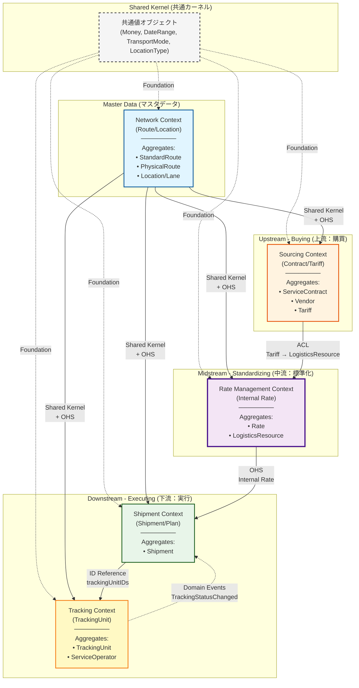

# ドメインモデル図

## Context Map（境界づけられたコンテキストと集約の関係）

このセクションでは、システム全体の境界づけられたコンテキスト（Bounded Context）の関係を抽象化して表現します。



### コンテキストマッピングパターンの説明

#### Shared Kernel (共通カーネル)
- **Money, DateRange, TransportMode, LocationType**: 全コンテキストで共有される基本的な値オブジェクト
- すべてのコンテキストが同じ定義を使用し、相互運用性を保証

#### OHS (Open Host Service: 公開ホストサービス)
- **Network Context**: 全社的な共通言語（ロケーション、レーン、標準ルート）を提供
- 他のコンテキストは Network が公開するサービスを自由に利用可能
- マスタデータとしての役割：安定したインターフェースを提供

#### ACL (Anti-Corruption Layer: 腐敗防止層)
- **Sourcing → Rate Management**: 業者の生データ（Tariff）を社内標準（LogisticsResource）に変換
- Rate Management は Sourcing の内部モデルに依存せず、独自のモデルを維持
- データ変換ロジックにより、Sourcing の変更から Rate Management を保護

#### ID Reference (ID参照)
- **Shipment → Tracking**: 集約境界を超える参照はIDのみ
- 集約の独立性を保ち、疎結合を実現
- TrackingUnit は Shipment への参照を持たない（一方向参照）

#### Domain Events (ドメインイベント)
- **Tracking → Shipment**: 実績ステータス変化を非同期通知
- TrackingStatusChanged イベントを通じて Shipment のステータスを更新（Derived Status）
- 逆方向の直接参照を避け、結合度を低く保つ

### ビジネスフローとコンテキスト

1. **上流（Upstream - Buying）**: Sourcing Context
   - 物流企業との契約交渉、入札プロセス、料金表の受領

2. **中流（Midstream - Standardizing）**: Rate Management Context
   - 複数業者の料金表を組み合わせた社内標準レート作成
   - 社内向けの統一された料金体系を整備

3. **下流（Downstream - Executing）**: Shipment Context + Tracking Context
   - 出荷案件の計画・実行（Shipment）
   - 実績追跡と記録（Tracking）

---

## DDD 概念モデル

このドメインモデルは、国際物流SCMプラットフォームのコア設計を表現しています。
商流（Shipment）と実行（TrackingUnit）を分離し、各時点での費用算出とGap分析を可能にします。
ルート管理は「計画（StandardRoute）と実績（TrackingSegment）の分離」パターンを採用しています。

### パッケージ構造マッピング

各集約は境界づけられたコンテキスト（Bounded Context）に従ってパッケージ化されています：

- **Shared Kernel (共通値オブジェクト層)** → `shared/`
- **Network BC (ルーティング集約)** → `network/domain/route/`
- **Sourcing BC (商取引集約)** → `sourcing/domain/contract/`
- **Sourcing BC (料金表集約)** → `sourcing/domain/pricing/`
- **Sourcing BC (入札アプリケーション)** → `sourcing/application/bid/`
- **Sourcing BC (料金表アプリケーション)** → `sourcing/application/tariff/`
- **Sourcing BC (インフラ)** → `sourcing/infrastructure/parser/`
- **Rate Management BC (社内レート集約)** → `rate/domain/rate/`
- **Rate Management BC (レートアプリケーション)** → `rate/application/rate/`
- **Shipment BC (出荷案件集約)** → `shipment/domain/shipment/`
- **Tracking BC (追跡集約)** → `tracking/domain/tracking/`

パッケージ間の依存関係:
```
shared (foundation - no dependencies)
  ↑
  ├─ network/domain/route (physical network)
  ├─ tracking/domain/tracking (execution tracking)
  ├─ sourcing/domain/contract (contracts & providers)
  └─ sourcing/domain/pricing (tariffs & calculation logic)
       ↑
       ├─ rate/domain/rate (shipper's internal rates)
       └─ shipment/domain/shipment (shipment execution)
```

**依存ルール**:
1. `shared`は他のドメインパッケージに依存しない
2. `sourcing/domain/contract`は`shared`のみに依存
3. `sourcing/domain/pricing`は`shared`, `network/domain/route`に依存
4. `rate/domain/rate`は`shared`, `network/domain/route`に依存
5. `shipment/domain/shipment`は`shared`, `network/domain/route`, `tracking/domain/tracking`, `sourcing/domain/pricing`に依存
6. 循環依存は禁止

```mermaid
classDiagram
    %% ============================================
    %% Shared Layer (共通値オブジェクト層)
    %% ============================================
    class Money["金額<br/>(Money)"] {
        Amount: Decimal
        Currency: String
    }

    class DateRange["期間<br/>(DateRange)"] {
        From: Time
        To: Time
    }

    class TransportMode["輸送モード<br/>(TransportMode)"] {
        <<enumeration>>
        OCEAN
        AIR
        TRUCK
        Railway
    }

    class LocationType["拠点種別<br/>(LocationType)"] {
        <<enumeration>>
        PORT
        AIRPORT
        RAIL_TERMINAL
        WAREHOUSE
        CONTAINER_YARD
        DOOR
        BORDER
    }

    class TrackingStatus["追跡ステータス<br/>(TrackingStatus)"] {
        <<enumeration>>
        BOOKED
        IN_TRANSIT
        EXCEPTION
        ARRIVED
    }

    %% ============================================
    %% Route Aggregate (ルーティング集約) - network/domain/route
    %% ============================================
    namespace ルーティング集約 {
        class Location["拠点<br/>(Location)"] {
            ID: UUID
            Name: String
            UnLocode: String
            CountryCode: String
            Type: String
        }

        class Lane["輸送路<br/>(Lane)"] {
            ID: UUID
            OriginID: UUID
            DestinationID: UUID
            Mode: TransportMode
            DistanceKm: Decimal
        }

        class StandardRoute["標準ルート<br/>(StandardRoute)"] {
            <<Aggregate Root>>
            ID: UUID
            Name: String
            ShipperID: UUID
            OriginLocationID: UUID
            DestinationLocationID: UUID
            legs: StandardRouteLeg[]
            status: StandardRouteStatus
            StandardLeadTimeDays: Int
            TargetCost: Money
            ValidPeriod: DateRange
            CreatedAt: Time
            UpdatedAt: Time
        }

        class StandardRouteStatus["標準ルートステータス<br/>(StandardRouteStatus)"] {
            <<enumeration>>
            ACTIVE
            ARCHIVED
        }

        class StandardRouteLeg["標準ルート区間<br/>(StandardRouteLeg)"] {
            <<Value Object>>
            SequenceOrder: Int
            OriginLocationID: UUID
            DestLocationID: UUID
            TargetMode: TransportMode
            StandardTransitDays: Int
            MasterLaneID: UUID
        }

        class PhysicalRoute["物理ルート<br/>(PhysicalRoute)"] {
            ID: UUID
            OriginID: UUID
            DestinationID: UUID
        }

        class RouteSegment["ルート区間<br/>(RouteSegment)"] {
            ID: UUID
            SequenceOrder: Int
            OriginLocationID: UUID
            OriginType: LocationType
            DestLocationID: UUID
            DestType: LocationType
            Mode: TransportMode
            DistanceKm: Decimal
            MasterLaneID: UUID
        }
    }

    %% ============================================
    %% Commercial Aggregate (商取引集約) - sourcing/domain/contract
    %% ============================================
    namespace 商取引集約 {
        class Vendor["ベンダー<br/>(Vendor)"] {
            <<Aggregate Root>>
            ID: UUID
            Name: String
            Type: ProviderType
            CreditRating: CreditRating
            PaymentTerms: PaymentTerms
            PreferredVendor: Bool
            Capabilities: VendorCapability[]
            Contacts: VendorContact[]
            CreatedAt: Time
            UpdatedAt: Time
        }

        class ProviderType["業者種別<br/>(ProviderType)"] {
            <<enumeration>>
            CARRIER
            AIRLINE
            TRUCKING_COMPANY
            FORWARDER
            NVOCC
            WAREHOUSE
            CUSTOMS_BROKER
        }

        class CreditRating["信用格付<br/>(CreditRating)"] {
            <<enumeration>>
            AAA
            AA
            A
            BBB
            BB
            B
            CCC
            CC
            C
            D
        }

        class PaymentTerms["支払条件<br/>(PaymentTerms)"] {
            <<Value Object>>
            DaysFromInvoice: Int
            Currency: String
        }

        class VendorCapability["ベンダー能力<br/>(VendorCapability)"] {
            <<Value Object>>
            ServiceType: String
            CoverageArea: String[]
        }

        class VendorContact["ベンダー担当者<br/>(VendorContact)"] {
            <<Value Object>>
            Name: String
            Role: String
            Email: String
            Phone: String
            IsPrimaryPOC: Bool
        }

        class ServiceContract["サービス契約<br/>(ServiceContract)"] {
            <<Aggregate Root>>
            ID: UUID
            ProviderID: UUID
            ShipperID: UUID
            status: ContractStatus
            ValidPeriod: DateRange
            CreatedAt: Time
            UpdatedAt: Time
        }

        class ContractStatus["契約ステータス<br/>(ContractStatus)"] {
            <<enumeration>>
            DRAFT
            CONTRACTED
            EXPIRED
            CANCELLED
        }
    }

    %% ============================================
    %% Tariff Aggregate (料金表集約) - sourcing/domain/pricing
    %% ============================================
    namespace 料金表集約 {
        class Tariff["料金表<br/>(Tariff)"] {
            <<Aggregate Root>>
            ID: UUID
            ContractID: UUID
            Name: String
            Version: Int
            BaseVersionID: UUID
            EffectiveDate: DateRange
            CreatedAt: Time
            UpdatedAt: Time
        }

        class TariffLineItem["料金項目<br/>(TariffLineItem)"] {
            ID: UUID
            ChargeCode: String
            Category: String
            Scope: ServiceScope
            Logic: PricingStrategy
        }

        class CargoItem["貨物明細<br/>(CargoItem)"] {
            <<Value Object>>
            ID: UUID
            ProductName: String
            HSCode: String
            Quantity: Decimal
            WeightKG: Decimal
            VolumeM3: Decimal
            PackageType: String
            Properties: CargoProperties
        }

        class CargoProperties["貨物属性<br/>(CargoProperties)"] {
            <<Value Object>>
            HazmatClass: String
            TemperatureMinC: Int
            TemperatureMaxC: Int
            IsOversized: Bool
            IsFragile: Bool
        }

        class CargoSummary["貨物集計<br/>(CargoSummary)"] {
            <<Value Object>>
            TotalQuantity: Decimal
            TotalWeightKG: Decimal
            TotalVolumeM3: Decimal
            ChargeableWeightKG: Decimal
            ContainerRequirements: ContainerRequirement[]
        }

        class ContainerRequirement["コンテナ要件<br/>(ContainerRequirement)"] {
            <<Value Object>>
            ContainerType: String
            Count: Decimal
        }

        class CalculationRequest["計算リクエスト<br/>(CalculationRequest)"] {
            <<Value Object>>
            Route: PhysicalRoute
            Items: CargoItem[]
            Summary: CargoSummary
            Conditions: CalculationConditions
        }

        class CalculationConditions["計算条件<br/>(CalculationConditions)"] {
            <<Value Object>>
            DesiredShipDate: Time
            Incoterms: String
            SpecialRequirements: String[]
            Attributes: Map
        }

        class TariffCalculationResult["料金計算結果<br/>(TariffCalculationResult)"] {
            <<Value Object>>
            TariffID: UUID
            TariffName: String
            AppliedItems: AppliedChargeItem[]
            SkippedItems: SkippedChargeItem[]
            TotalAmounts: CurrencyTotal[]
        }

        class AppliedChargeItem["適用費目<br/>(AppliedChargeItem)"] {
            <<Value Object>>
            LineItemID: UUID
            ChargeCode: String
            Category: String
            Amount: Money
            ScopeDescription: String
        }

        class SkippedChargeItem["スキップ費目<br/>(SkippedChargeItem)"] {
            <<Value Object>>
            LineItemID: UUID
            ChargeCode: String
            Category: String
            Reason: String
        }

        class CurrencyTotal["通貨別合計<br/>(CurrencyTotal)"] {
            <<Value Object>>
            Currency: String
            Amount: Money
        }
    }

    %% ============================================
    %% Rate Aggregate (社内レート集約) - rate/domain/rate
    %% ============================================
    namespace 社内レート集約 {
        class Rate["社内レート<br/>(Rate)"] {
            <<Aggregate Root>>
            ID: UUID
            ShipperID: UUID
            Name: String
            ValidPeriod: DateRange
            status: RateStatus
            entries: RateEntry[]
            CreatedAt: Time
            UpdatedAt: Time
        }

        class RateStatus["レートステータス<br/>(RateStatus)"] {
            <<enumeration>>
            DRAFT
            ACTIVE
            EXPIRED
        }

        class RateEntry["レートエントリ<br/>(RateEntry)"] {
            ID: UUID
            ProviderID: UUID
            ContractID: UUID
            TariffID: UUID
        }

        class RouteScope["ルート適用範囲<br/>(RouteScope)"] {
            <<Value Object>>
            OriginID: UUID
            DestinationID: UUID
            TransportMode: TransportMode
        }

        class LogisticsResource["物流リソース<br/>(LogisticsResource)"] {
            ProviderID: UUID
            Name: String
            Capabilities: ResourceCapability[]
            IsAvailable: Bool
        }

        class ResourceCapability["リソース能力<br/>(ResourceCapability)"] {
            <<Value Object>>
            RouteScope: RouteScope
            TransportMode: TransportMode
            Capacity: CapacitySpec
            RateLevel: RateLevel
            LeadTimeDays: Int
            ReliabilityPct: Int
        }

        class CapacitySpec["能力スペック<br/>(CapacitySpec)"] {
            <<Value Object>>
            MaxWeightKG: Decimal
            MaxVolumeM3: Decimal
            ContainerTypes: String[]
            SpecialHandling: String[]
        }

        class RateLevel["料金レベル<br/>(RateLevel)"] {
            <<enumeration>>
            HIGH
            MEDIUM
            LOW
        }
    }

    %% ============================================
    %% Shipment Aggregate (出荷案件集約) - shipment/domain/shipment
    %% ============================================
    namespace 出荷案件集約 {
        class Shipment["出荷案件<br/>(Shipment)"] {
            <<Aggregate Root>>
            ID: UUID
            ShipmentNo: String
            ShipperID: UUID
            ConsigneeID: UUID
            trackingUnitIDs: UUID[]
            status: ShipmentStatus
            CreatedAt: Time
            UpdatedAt: Time
        }

        class ShipmentStatus["出荷ステータス<br/>(ShipmentStatus)"] {
            <<enumeration>>
            PLANNED
            BOOKED
            IN_TRANSIT
            EXCEPTION
            COMPLETED
            CANCELLED
        }

        class ShipmentPlan["出荷計画<br/>(ShipmentPlan)"] {
            StandardRouteID: UUID
            PlannedRoute: PhysicalRoute
            RateID: UUID
            TransportRequirements: Map
        }

        class ShipmentItem["貨物明細<br/>(ShipmentItem)"] {
            ID: UUID
            Commodity: String
            HSCode: String
            Quantity: Decimal
            WeightKG: Decimal
            VolumeM3: Decimal
            PackageType: String
            LoadedOnTrackingID: UUID
            Attributes: Map
        }

        class ShipmentCost["出荷費用<br/>(ShipmentCost)"] {
            EstimatedCost: EstimatedCost
            EstimatedActualCost: EstimatedActualCost
            ActualCost: ActualCost
            IsFinalized: Bool
        }
    }

    %% ============================================
    %% Tracking Aggregate (追跡集約) - tracking/domain/tracking
    %% ============================================
    namespace 追跡集約 {
        class TrackingUnit["追跡単位<br/>(TrackingUnit)"] {
            <<Aggregate Root>>
            ID: UUID
            TrackingNumber: TrackingNumber
            CarrierID: UUID
            segments: TrackingSegment[]
            currentStatus: TrackingStatus
            LastUpdated: Time
        }

        class TrackingNumber["追跡番号<br/>(TrackingNumber)"] {
            <<Value Object>>
            Number: String
            Type: TrackingNumberType
        }

        class TrackingNumberType["追跡番号種別<br/>(TrackingNumberType)"] {
            <<enumeration>>
            CONTAINER
            AIRWAY_BILL
            BILL_OF_LADING
            BOOKING_NUMBER
        }

        class TrackingSegment["追跡区間<br/>(TrackingSegment)"] {
            ID: UUID
            ActualOriginLocationID: UUID
            ActualDestLocationID: UUID
            Mode: TransportMode
            CarrierTrackingNumber: String
            PrimarySource: TrackingSourceType
            Status: TrackingStatus
            ActualDeparture: Time
            ActualArrival: Time
            EstimatedArrival: Time
        }

        class TrackingEvent["追跡イベント<br/>(TrackingEvent)"] {
            <<Value Object>>
            ID: UUID
            Timestamp: Time
            Source: TrackingSourceType
            Code: String
            Description: String
            LocationRaw: String
            RawPayload: String
        }

        class TrackingSourceType["追跡情報源<br/>(TrackingSourceType)"] {
            <<enumeration>>
            SEARATES_API
            MANUAL_INPUT
            PARTNER_EDI
            DRIVER_APP
            IOT_DEVICE
        }

        class ServiceOperator["実行業者<br/>(ServiceOperator)"] {
            ProviderID: UUID
            Name: String
            Role: OperatorRole
            OperationalContacts: OperationalContact[]
            PerformanceMetrics: PerformanceMetrics
            IntegrationChannels: IntegrationChannel[]
        }

        class OperatorRole["業者役割<br/>(OperatorRole)"] {
            <<enumeration>>
            TRANSPORTER
            WAREHOUSE
            CUSTOMS_BROKER
            DELIVERY_AGENT
            PACKING_SERVICE
            INSPECTOR
        }

        class OperationalContact["実務担当者<br/>(OperationalContact)"] {
            <<Value Object>>
            Name: String
            Role: String
            Email: String
            Phone: String
            MobilePhone: String
            Available24x7: Bool
            Languages: String[]
            IsPrimaryPOC: Bool
        }

        class PerformanceMetrics["実行品質<br/>(PerformanceMetrics)"] {
            <<Value Object>>
            OnTimeDeliveryRate: Decimal
            AverageResponseTime: Int
            ExceptionRate: Decimal
            LastUpdated: Time
        }

        class IntegrationChannel["連携チャネル<br/>(IntegrationChannel)"] {
            <<Value Object>>
            Type: IntegrationChannelType
            Endpoint: String
            IsActive: Bool
            Credentials: String
        }

        class IntegrationChannelType["連携チャネル種別<br/>(IntegrationChannelType)"] {
            <<enumeration>>
            API
            EDI
            WEBHOOK
            EMAIL
            DRIVER_APP
            MANUAL
        }
    }

    %% ============================================
    %% Cost (費用関連)
    %% ============================================
    class EstimatedCost["見積費用<br/>(EstimatedCost)"] {
        <<Value Object>>
        RateID: UUID
        TotalAmount: Money
        CalculatedAt: Time
        CalculationBase: String
    }

    class EstimatedActualCost["想定実費用<br/>(EstimatedActualCost)"] {
        <<Value Object>>
        ShipmentID: UUID
        RateID: UUID
        TotalAmount: Money
        CalculatedAt: Time
        CalculationBase: String
    }

    class ActualCost["実請求額<br/>(ActualCost)"] {
        <<Value Object>>
        InvoiceID: UUID
        InvoiceNo: String
        ProviderID: UUID
        TotalAmount: Money
        InvoiceDate: Time
    }

    class SegmentCost["区間費用<br/>(SegmentCost)"] {
        <<Value Object>>
        SegmentID: UUID
        SegmentIndex: Int
        OriginLocationID: UUID
        DestLocationID: UUID
        Mode: TransportMode
        TotalAmount: Money
        CalculationStatus: SegmentCostStatus
    }

    class CostLineItem["費用明細行<br/>(CostLineItem)"] {
        <<Value Object>>
        ID: UUID
        ChargeCode: String
        ChargeName: String
        Category: String
        Amount: Money
    }

    class SegmentCostStatus["区間費用計算ステータス<br/>(SegmentCostStatus)"] {
        <<enumeration>>
        COMPLETED
        IN_PROGRESS
        PLANNED
        NOT_APPLICABLE
    }

    %% ============================================
    %% Logic Layer (ビジネスロジック層)
    %% ============================================
    class ServiceScope["サービス適用範囲<br/>(ServiceScope)"] {
        <<interface>>
    }

    class PricingStrategy["料金計算戦略<br/>(PricingStrategy)"] {
        <<interface>>
    }

    %% ============================================
    %% Relationships (関連)
    %% ============================================

    %% Route Aggregate
    StandardRoute "1" *-- "1..n" StandardRouteLeg : 含む
    StandardRouteLeg --> Location : 出発地
    StandardRouteLeg --> Location : 到着地
    StandardRouteLeg --> Lane : 参照(任意)
    PhysicalRoute "1" *-- "1..n" RouteSegment : 含む
    RouteSegment --> Location : 出発地
    RouteSegment --> Location : 到着地
    RouteSegment --> Lane : 参照(任意)
    Lane --> Location : 出発地
    Lane --> Location : 到着地

    %% Commercial Aggregate
    ServiceContract --> Vendor : 業者参照(ProviderID)
    Vendor ..> ProviderType : uses
    Vendor ..> CreditRating : uses
    Vendor "1" *-- "0..n" PaymentTerms : 含む
    Vendor "1" *-- "0..n" VendorCapability : 含む
    Vendor "1" *-- "0..n" VendorContact : 含む

    %% Tariff Aggregate
    Tariff --> ServiceContract : 契約参照(ContractID)
    Tariff "1" *-- "1..n" TariffLineItem : 含む
    Tariff --> Tariff : バージョン元(任意)
    TariffLineItem --> ServiceScope : 適用範囲
    TariffLineItem --> PricingStrategy : 計算ロジック
    CargoItem "1" *-- "1" CargoProperties : 含む
    CargoSummary "1" *-- "0..n" ContainerRequirement : 含む
    CalculationRequest "1" *-- "0..n" CargoItem : 含む
    CalculationRequest "1" *-- "1" CargoSummary : 含む
    CalculationRequest "1" *-- "1" CalculationConditions : 含む
    CalculationRequest --> PhysicalRoute : ルート参照
    TariffCalculationResult "1" *-- "0..n" AppliedChargeItem : 含む
    TariffCalculationResult "1" *-- "0..n" SkippedChargeItem : 含む
    TariffCalculationResult "1" *-- "0..n" CurrencyTotal : 含む
    AppliedChargeItem ..> Money : uses
    CurrencyTotal ..> Money : uses

    %% Rate Aggregate
    Rate "1" *-- "0..n" RateEntry : 含む
    RateEntry --> RouteScope : 適用ルート範囲
    RateEntry --> Vendor : 業者参照(ProviderID)
    RateEntry --> ServiceContract : 契約参照
    RateEntry --> Tariff : 料金表参照
    RouteScope --> Location : 出発地(任意)
    RouteScope --> Location : 到着地(任意)
    LogisticsResource --> Vendor : 業者参照(ProviderID)
    LogisticsResource "1" *-- "0..n" ResourceCapability : 含む
    ResourceCapability --> RouteScope : 適用範囲
    ResourceCapability --> CapacitySpec : 能力スペック
    ResourceCapability ..> RateLevel : uses

    %% Shipment Aggregate
    Shipment "1" *-- "1" ShipmentPlan : 含む
    Shipment "1" *-- "0..n" ShipmentItem : 含む
    Shipment "1" *-- "1" ShipmentCost : 含む
    Shipment --> TrackingUnit : 追跡参照
    ShipmentPlan --> StandardRoute : 基準ルート参照(任意)
    ShipmentPlan --> PhysicalRoute : 計画ルート(コピー)
    ShipmentPlan --> Rate : レート参照
    ShipmentItem --> TrackingUnit : 積載先参照(任意)
    ShipmentCost --> EstimatedCost : 見積費用(任意)
    ShipmentCost --> EstimatedActualCost : 想定実費用(任意)
    ShipmentCost --> ActualCost : 実請求額(任意)

    %% Tracking Aggregate
    TrackingUnit "1" *-- "1..n" TrackingSegment : 含む
    TrackingSegment "1" *-- "0..n" TrackingEvent : 含む
    TrackingSegment --> Location : 実出発地
    TrackingSegment --> Location : 実到着地
    ServiceOperator --> Vendor : 業者参照(ProviderID)
    ServiceOperator "1" *-- "0..n" OperationalContact : 含む
    ServiceOperator "1" *-- "1" PerformanceMetrics : 含む
    ServiceOperator "1" *-- "0..n" IntegrationChannel : 含む
    ServiceOperator ..> OperatorRole : uses

    %% Cost Relations
    EstimatedCost "1" *-- "1..n" CostLineItem : 含む
    EstimatedActualCost "1" *-- "1..n" SegmentCost : 含む
    SegmentCost "1" *-- "1..n" CostLineItem : 含む
    ActualCost "1" *-- "1..n" CostLineItem : 含む
    EstimatedCost ..> Money : uses
    EstimatedActualCost ..> Money : uses
    ActualCost ..> Money : uses
    SegmentCost ..> Money : uses
    CostLineItem ..> Money : uses

    %% Notes (ビジネスルール・制約)
    note for StandardRoute "・荷主が管理する「標準ルート」（規範: Prescriptive）<br/>・入札（RFQ）、予算策定、発注時の指定に使用<br/>・ステータス遷移: ACTIVE → ARCHIVED<br/>・legs, statusフィールドはprivate、getter経由でアクセス<br/>・発注時にPlannedRoute(PhysicalRoute)としてコピーされる<br/>・StandardLeadTimeDays: 全体の目標リードタイム<br/>・TargetCost: 予算上の目標費用（任意）"

    note for StandardRouteLeg "・計画コンテキスト専用の区間VO<br/>・TargetMode: この区間で想定する輸送モード<br/>・StandardTransitDays: この区間の目標所要日数<br/>・RouteSegment（実データ向け）とは異なる関心事を持つ"

    note for ServiceContract "・ステータス遷移: DRAFT → CONTRACTED → EXPIRED/CANCELLED<br/>・DRAFT状態: 入札段階で複数業者から料金表を受領<br/>・CONTRACTED状態: 契約成立後も料金表改定可能<br/>・statusフィールドはprivate、getter経由でアクセス<br/>・料金表(Tariff)は独立集約として分離（ContractIDで参照）"

    note for Tariff "・独立した集約ルート（ContractIDで契約を参照）<br/>・バージョン管理: 同じ名前でもVersionが異なれば別レコード<br/>・Version=1, BaseVersionID=nil: 初版<br/>・Version>1, BaseVersionID設定: 改定版<br/>・EventRecorder埋め込みでドメインイベント記録<br/>・CalculateCharges: CalculationRequestに基づき各費目のコストを計算<br/>　- Scope判定でスキップ/適用を振り分け<br/>　- 複数通貨混在を許容し通貨別に集計"

    note for Rate "・ステータス遷移: DRAFT → ACTIVE → EXPIRED<br/>・複数業者のTariffからルート単位で選択・組み合わせた社内レート<br/>・DRAFT状態: エントリ追加・削除・Tariff差し替え可能<br/>・ACTIVE状態: エントリの変更不可<br/>・entries, statusフィールドはprivate、getter経由でアクセス"

    note for Shipment "・計画（PlannedRoute）の管理者<br/>・StandardRouteIDで基準とした標準ルートを追跡可能<br/>・TrackingUnitへの参照はIDのみ保持（集約境界）<br/>・ShipmentStatusはTrackingUnitの状態から導出（Derived Status）<br/>・trackingUnitIDs, status, costフィールドはprivate、getter経由でアクセス"

    note for TrackingUnit "・実績の記録者（計画への参照を持たない）<br/>・物理的な輸送単位（コンテナ1本、トラック1台など）<br/>・TrackingSegmentが実績ルート（ActualRoute）の実体<br/>・currentStatusは全セグメントの状態から再計算<br/>・segments, currentStatusフィールドはprivate、getter経由でアクセス"

    note for RouteScope "・レートエントリの適用ルート範囲を定義<br/>・OriginID=nil: 全出発地に適用<br/>・DestinationID=nil: 全到着地に適用<br/>・TransportMode=nil: 全輸送モードに適用"

    note for Money "・通貨必須の金額値オブジェクト<br/>・Add/Sub時に通貨一致チェック実施<br/>・異なる通貨の演算時はCURRENCY_MISMATCHエラー"

    note for Vendor "・契約コンテキストにおける物流企業（契約の主体）<br/>・信用格付、支払条件など商取引関心事を管理<br/>・LogisticsProviderは後方互換性のためのエイリアス<br/>・ProviderIDで他コンテキストと紐づく（コンテキストマッピング）"

    note for LogisticsResource "・レート・計画コンテキストにおける物流企業（能力とコストの提供者）<br/>・「誰が運べるか」ではなく「何を運べるか」に焦点<br/>・ProviderIDで契約コンテキストのVendorと紐づく<br/>・能力（Capability）とレート特性を持つ"

    note for ServiceOperator "・実行コンテキストにおける物流企業（業務の遂行者）<br/>・実務担当者、連絡先、実行役割に焦点<br/>・ProviderIDで契約コンテキストのVendorと紐づく<br/>・実行品質メトリクスとシステム連携情報を持つ"
```

## レイヤー説明

### 1. Shared Layer (共通値オブジェクト層)
- **Money**: 金額と通貨を表現。通貨一致チェック付きの演算メソッドを提供
- **DateRange**: 期間を表現（契約有効期限、料金適用期間など）
- **TransportMode**: 輸送モード（海上、航空、トラック、鉄道）
- **LocationType**: 拠点種別（港、空港、倉庫など）
- **TrackingStatus**: トラッキングステータス（BOOKED, IN_TRANSIT, ARRIVED, EXCEPTION）

### 2. Route Aggregate (ルーティング集約)
- **Location**: 物理的な拠点（港、倉庫、空港など）
- **Lane**: 2点間の物理的な輸送路（マスターデータ）
- **StandardRoute**: 荷主が管理する「標準ルート」（集約ルート）
  - 入札、予算策定、発注時の指定、リードタイム基準値の設定に使用
  - 性質: 「規範（Prescriptive）」 - あるべき姿を定義するマスタデータ
  - StandardRouteStatus: ACTIVE → ARCHIVED
  - `legs`, `status` フィールドはprivateでgetter経由でアクセス
  - 発注時に `PhysicalRoute` としてコピーされ、`ShipmentPlan` に保持される
- **StandardRouteLeg**: 標準ルートの1区間（値オブジェクト）
  - 計画コンテキスト専用の属性（目標モード、目標所要日数）を持つ
  - `RouteSegment`（実データ向け）とは異なる関心事を持つ
- **PhysicalRoute**: 順序を持った区間の集合体（Origin→Destination）
  - Shipment発注時に `StandardRoute` からコピーされた計画値
- **RouteSegment**: A地点からB地点への移動を表す最小単位

### 3. Commercial Aggregate (商取引集約)
- **ServiceContract**: 契約（集約ルート）
  - 入札プロセスにおいて物流企業との契約情報を管理
  - ContractStatus: DRAFT（入札段階）→ CONTRACTED（契約成立）→ EXPIRED/CANCELLED
  - `status` フィールドはprivateでgetter経由でアクセス
  - 料金表(Tariff)は独立集約として分離（ContractIDで参照）
  - **入札フロー**:
    1. DRAFT契約を作成
    2. 業者から提示された料金表を登録（Tariff集約として保存）
    3. 荷主が各DRAFT契約を比較検討
    4. 最適な契約を正式化（CONTRACTED）
    5. 他の契約をキャンセル（CANCELLED）
- **Vendor**: 契約コンテキストにおける物流企業（契約の主体）
  - 契約相手としての企業情報を管理
  - 信用格付（CreditRating）、支払条件（PaymentTerms）、優先ベンダーフラグ
  - 提供可能サービス（VendorCapability）、商務担当者情報（VendorContact）
  - LogisticsProviderは後方互換性のためのエイリアス

### 3.5. Tariff Aggregate (料金表集約)
- **Tariff**: 料金表（独立した集約ルート）
  - ContractIDで所属するサービス契約を参照（ID参照による疎結合）
  - EventRecorder埋め込みでドメインイベントを記録
  - **バージョン管理**: 同じ業者から改定版の料金表を受け取った場合、履歴を保持
    - `Version`: バージョン番号（1, 2, 3...）
    - `BaseVersionID`: 元となったTariffのID（初版の場合はnil）
  - **CalculateCharges**: CalculationRequestに基づき各費目のコストを計算
    - Scope判定で適用/スキップを振り分け
    - 複数通貨混在を許容し通貨別にTotalAmountsを集計
- **TariffLineItem**: 個別の料金定義（THC、運賃など）
- **CargoItem**: 個別の貨物明細（品名、HSコード、重量、容積、属性）
- **CargoProperties**: 貨物属性（危険物クラス、温度管理、超過サイズ等）
- **CargoSummary**: 貨物集計情報（総数量、総重量、課金重量、コンテナ要件）
- **ContainerRequirement**: コンテナ要件（コンテナ種別、必要数）
- **CalculationRequest**: 料金計算リクエスト（ルート + 貨物 + 条件）
- **CalculationConditions**: 計算条件（出荷希望日、インコタームズ、特殊要件）
- **TariffCalculationResult**: 料金計算結果（適用費目、スキップ費目、通貨別合計）
- **AppliedChargeItem**: 適用された費目の計算結果
- **SkippedChargeItem**: スキップされた費目（理由付き）
- **CurrencyTotal**: 通貨別の合計金額

### 4. Rate Aggregate (社内レート集約)
- **Rate**: 社内レート（集約ルート）
  - 荷主が複数業者のTariffからルート単位で選択・組み合わせた通期レート
  - RateStatus: DRAFT（作成中）→ ACTIVE（使用可能）→ EXPIRED（期限切れ）
  - `status`, `entries` フィールドはprivateでgetter経由でアクセス
- **RateEntry**: レートの構成要素（特定の業者の特定のTariffをまるごと採用）
- **RouteScope**: レートエントリの適用ルート範囲（値オブジェクト）
- **LogisticsResource**: レート・計画コンテキストにおける物流企業（能力とコストの提供者）
  - "誰が運べるか"ではなく"何を運べるか"に焦点を当てたモデル
  - ProviderIDで契約コンテキストのVendorと紐づく（コンテキストマッピング）
  - ResourceCapability: 提供可能な輸送能力（ルート範囲、輸送モード、能力スペック）
  - RateLevel: 料金レベル（HIGH/MEDIUM/LOW）による簡易判断
  - LeadTimeDays, ReliabilityPctなどの計画指標

### 5. Shipment Aggregate (出荷案件集約)
- **Shipment**: 出荷案件（集約ルート）
  - 荷主視点での「1つの仕事」を表現
  - `status`, `cost`, `trackingUnitIDs` フィールドはprivateでgetter経由でアクセス
- **ShipmentPlan**: 計画情報（エンティティ）
  - `StandardRouteID`: 基準とした標準ルートへのID参照（追跡可能性の確保）
  - `PlannedRoute`: StandardRouteからコピーされた計画値（PhysicalRoute VO）
  - `RateID`: 社内レートへの参照
- **ShipmentItem**: 貨物明細（エンティティ）
- **ShipmentCost**: 費用情報（エンティティ）

### 6. Tracking Aggregate (追跡集約)
- **TrackingUnit**: 追跡単位（集約ルート）
  - `currentStatus`, `segments` フィールドはprivateでgetter経由でアクセス
  - 計画への参照を持たない：純粋な実績記録にフォーカス
  - `TrackingSegment` の集合が実績ルート（ActualRoute）の実体となる
- **TrackingSegment**: 実際に発生した移動区間（エンティティ）
  - 実績コンテキスト専用の属性（実績日時、キャリア追跡番号、情報源）を持つ
- **TrackingEvent**: 追跡イベント（値オブジェクト）
- **ServiceOperator**: 実行コンテキストにおける物流企業（業務の遂行者）
  - 実務担当者、連絡先、実行役割に焦点を当てたモデル
  - ProviderIDで契約コンテキストのVendorと紐づく（コンテキストマッピング）
  - OperatorRole: 具体的な役割（TRANSPORTER, WAREHOUSE, CUSTOMS_BROKER等）
  - OperationalContact: 実務担当者情報（24x7対応可否、使用言語等）
  - PerformanceMetrics: 実行品質（定時配送率、平均応答時間、例外発生率）
  - IntegrationChannel: システム連携（API, EDI, WEBHOOK, DRIVER_APP等）

### 7. Cost (費用関連)
- **EstimatedCost**: 見積費用（計画時点での推定費用）
- **EstimatedActualCost**: 想定実費用（トラッキング実績ベース）
- **ActualCost**: 実請求額（外部インボイスデータ）
- **SegmentCost**: セグメント単位の費用内訳
- **CostLineItem**: 費用明細行

### 8. Logic Layer (ビジネスロジック層)
- **ServiceScope**: 料金適用範囲を判定するインターフェース
- **PricingStrategy**: 料金計算ロジックのインターフェース

## 主要な設計パターン

1. **Aggregate分離と境界**:
   - ShipmentとTrackingUnitを独立した集約として分離
   - ServiceContractは契約ステータス管理に専念（料金表はTariff集約に分離）
   - Tariffを独立した集約ルートとして管理（ContractIDで契約を参照）
   - Rateを集約ルートとしてRateEntryを管理（複数業者のTariffを組み合わせた社内レート）
   - StandardRouteを集約ルートとして荷主管理ルートを独立管理
   - 集約間の参照はIDのみ（疎結合）

2. **カプセル化**:
   - 集約ルートの重要フィールドはprivate（小文字）
   - getter メソッドで安全にアクセス（コレクションはコピー返却）
   - ファクトリ関数でバリデーション付き生成

3. **計画と実績の分離（Plan vs Actual）**:
   - **StandardRoute**: 荷主管理の「規範（Prescriptive）」ルート。あるべき姿
   - **PhysicalRoute（PlannedRoute）**: 発注時にStandardRouteからコピーされた計画値。当時の計画を保持
   - **TrackingSegment**: 物流企業の「記述（Descriptive）」実績。起きた事実
   - 3者を独立させることで、マスタ改定が過去の計画に影響しない

4. **ルート関連の型の使い分け**:
   - **StandardRouteLeg**: 計画コンテキスト向け（目標モード、目標日数）
   - **RouteSegment**: 発注時の計画値（物理情報: 距離、モード、拠点タイプ）
   - **TrackingSegment**: 実績コンテキスト向け（実績日時、キャリア情報、追跡番号）

5. **Value Object**: Money（通貨一致チェック付き演算）, DateRange（期間表現）, RouteScope（ルート適用範囲）, StandardRouteLeg（標準ルート区間）

6. **バージョン管理**: Tariffのバージョン管理により料金表の改定履歴を保持

7. **コンテキストマッピング（Context Mapping）**:
   - 物流企業（LSP）を境界づけられたコンテキストごとに異なるモデルで表現
   - **Vendor** (契約コンテキスト): 契約の主体。信用格付、支払条件など商取引関心事
   - **LogisticsResource** (レート・計画コンテキスト): 能力とコストの提供者。輸送能力、レート特性
   - **ServiceOperator** (実行コンテキスト): 業務の遂行者。実務担当者、実行品質、システム連携
   - 各モデルは`ProviderID`で契約コンテキストの`Vendor`と紐づく（Shared Kernel + ACL）
   - 同じProviderIDでも、コンテキストが異なれば関心事と属性が異なる

## ルート管理のライフサイクル

### 1. 計画フェーズ
```
SCM部がStandardRouteを作成・メンテナンス → 入札に利用
```

### 2. 発注フェーズ
```
StandardRoute →(コピー)→ ShipmentPlan.PlannedRoute (PhysicalRoute VO)
                           ShipmentPlan.StandardRouteID で追跡
```

### 3. 実行フェーズ
```
物流企業が輸送実行 → TrackingUnit.TrackingSegment[] が実績ルートとして蓄積
```

### 4. 分析フェーズ（予実管理）
```
RouteDeviationService:
  ShipmentPlan.PlannedRoute vs TrackingUnit.Segments → 逸脱検知
  （ルート逸脱、抜港、積み替え等の自動チェック）
```

### 5. フィードバック
```
分析結果 → 次期のStandardRouteの見直しに反映
```

## 費用計算の流れ

### 1. 計画時点（見積）
```
ShipmentPlan → EstimatedCost
```

### 2. トラッキング時点（想定実費用）
```
Shipment + TrackingUnit[] → EstimatedActualCost
                              ↓ contains
                           SegmentCost[]
```

### 3. 請求時点
```
EstimatedActualCost + ActualCost → CostGapAnalysis
```
